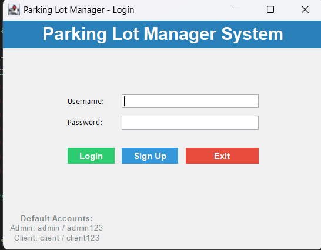
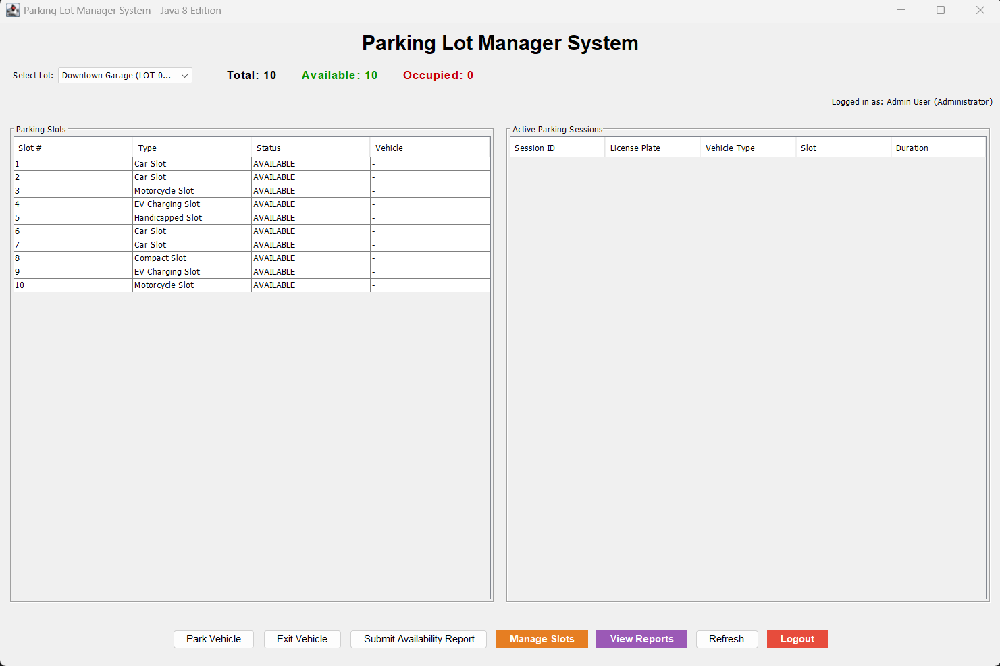

# Parking Manager System - Updated Project Structure

A comprehensive parking management system built with Java Swing and MySQL database, now organized with proper package structure.

New:





Old:


## **How to Run the Application**

## **Setup Steps**

1. **Database Setup:**

   ```sql
   mysql -u root -p < database_setup.sql
   ```

2. **Update Database Credentials:**
   Edit `src/com/parkingmanager/util/DatabaseConnection.java`:

   ```java
   private static final String USER = "your_mysql_username";
   private static final String PASSWORD = "your_mysql_password";
   ```

3. **Build and Run: for testing**
   `powershell`
   .\run-source.bat <!-- for testing -->
   .\run-source.bat <!-- for quick GUI  -->

## **Usage Features**

- **Park vehicles** - Select available spots and enter vehicle details
- **Calculate fees** - Automatic hourly rate calculation with minimum 1-hour charge
- **Real-time stats** - Available spots, occupied spots, total revenue
- **View data** - Tabular display of all spots and parked vehicles
- **Persistent storage** - All data saved to MySQL database

### **Method 1: Using the Source Build Script (Recommended)**

1. **Navigate to project directory:**

   ```powershell
   cd "d:\My projects2\parking manager"
   ```

2. **Run the source build script:**
   ```powershell
   .\run-source.bat
   ```

This script will:

- Compile all Java files from the `src/` directory with proper package structure
- Create a `build/` directory with compiled classes
- Run the application with correct classpath

### **Method 2: Manual Compilation**

1. **Compile with packages:**

   ```powershell
   javac -cp ".;mysql-connector-j-9.4.0.jar" -d build src/com/parkingmanager/model/*.java src/com/parkingmanager/util/*.java src/com/parkingmanager/dao/*.java src/com/parkingmanager/service/*.java src/com/parkingmanager/gui/*.java
   ```

2. **Run the application:**
   ```powershell
   java -cp "build;mysql-connector-j-9.4.0.jar" com.parkingmanager.gui.ParkingManagerGUI
   ```

### **Method 3: IDE Setup**

1. **Import project** into your IDE (IntelliJ IDEA, Eclipse, VS Code)
2. **Set source folder** to `src/`
3. **Add MySQL Connector JAR** to classpath
4. **Run** `com.parkingmanager.gui.ParkingManagerGUI`

##**Package Descriptions**

### **Model Layer (`com.parkingmanager.model`)**

- **ParkingSpot.java** - Entity representing parking spots with properties like number, type, availability, and rate
- **Vehicle.java** - Entity representing vehicles with license plate, type, parking duration, and fee calculation

### **Data Access Layer (`com.parkingmanager.dao`)**

- **ParkingSpotDAO.java** - CRUD operations for parking spots (create, read, update availability)
- **VehicleDAO.java** - CRUD operations for vehicles (create entries, checkout, get active vehicles)

### **Service Layer (`com.parkingmanager.service`)**

- **ParkingService.java** - Business logic coordinator that orchestrates operations between DAOs

### **Utility Layer (`com.parkingmanager.util`)**

- **DatabaseConnection.java** - Singleton database connection manager

### **GUI Layer (`com.parkingmanager.gui`)**

- **ParkingManagerGUI.java** - Swing-based user interface with tables, forms, and action handlers
